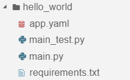
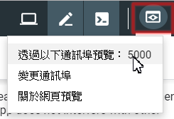

# 記錄一些 GAE 的經驗

不得說，google的引導式的教學還算蠻不錯的，但仍有些地方沒交代清楚

## flask hello world佈署
- 進GAE的面頁後，點一下右上角的cloud shell
    - 

- 在GAE的Python教學中，有請user使用這一個git
    - `git clone https://github.com/GoogleCloudPlatform/python-docs-samples`

- 教學使用這一個demo `python-docs-samples/appengine/standard_python37/hello_world`
    - 

- 其中：
    - app.yaml: 是用來說明程式要執行的條件的，[說明文件](https://cloud.google.com/appengine/docs/standard/python3/config/appref?hl=zh-tw)
    - main.py: 主程式
    - requirements.txt: 要安裝的套件

- 建立所需要的virtual env，並執行看看: 
    - `virtualenv --python python3 ~/envs/hello_world`
    - `source ~/envs/hello_world/bin/activate`
    - `pip install -r requirements.txt`
    - `python main.py`
    - 這裡有個很有趣，好像的看網頁方式--> 按下面這個圖，就可以穿透進去看到網頁，預設是8080
    - 

- deploy app
    - `gcloud app create`  --> 第一次要，第二次就不用了
    - `gcloud app deploy app.yaml --project` --> 文件是寫要打這樣，但我是打 `gcloud app deploy` 才ok的
    - 最後在browser上輸入網址就可以了 `<your-project>.appspot.com`

## 接著是佈署我自己的APP，我把我現有的web直接拿來使用，也真的正常運作了!

- 先把剛剛的demo copy一份出來，主要是要它的yaml檔
- 把我的程式都放進去後，建立venv
    - `virtualenv --python python3 venv`
    - `source venv/bin/activate`
    - `pip install -r requirements.txt`
    - `python app.py`
    - 再按眼睛就可以預覽網頁了

- deploy app
    - 設定project: `gcloud config set project malo-test`
    - `gcloud app deploy`
    - 然後就…失敗了，看不到網頁
    - 因為! 預設gae是執行main.py這一個檔案 (而我的主程式是app.py) (gae也是使用gunicorn)
    - 改個名字，再重新deploy就正常了

## Flask + SQL 在GAE上的配置
- [參考這一篇](https://blog.uccloud.com.tw/2018/10/28/%E9%83%A8%E7%BD%B2-django-2-%E8%87%B3-app-engine-2nd-%E6%A8%99%E6%BA%96%E7%92%B0%E5%A2%83%E6%95%99%E5%AD%B8/)

- 注意!! 應用程式的地區設定完成後即無法更改。
- 因為GAE, Cloud SQL在同一個點，效能比較好，所以作者建議都在`香港`

- [GAE地點](https://cloud.google.com/appengine/docs/locations)，看起來最近的就是這三個：
    - asia-northeast1 (東京)
    - asia-northeast2 (大阪)
    - asia-east2 (香港)

- [Cloud SQL](https://cloud.google.com/sql/docs/mysql/locations)，這個地點在亞洲就多了
	- asia-east1	台灣	
    - asia-east2	香港	僅第二代執行個體
    - asia-northeast1	東京	僅第二代執行個體
    - asia-northeast2	大阪	僅第二代執行個體
    - asia-south1	孟買	僅第二代執行個體
    - asia-southeast1	新加坡	僅第二代執行個體

- 待續… (還正在從NoSQL改成SQL中…)