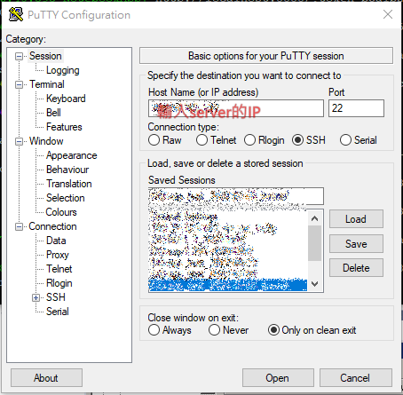
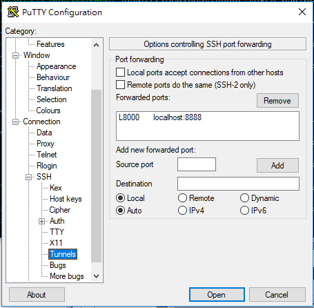

# VPS install lxde @ DigitalOcean

- ubuntu 20.04
- 1G / 25G / 1TB / 1CPU
- 選password

----

## 前置設定
- 先用root連進去 (從web console來連也可以)
- 建一個平時用的帳號:  
- adduser user1
- 可以把新user加入sudo權限
- usermod -aG sudo user1
- 用 `ufw status` 看防火牆是 inactive的--> ufw是沒有啟用的 → 很危險，因為root容易被try過
- `ufw allow OpenSSH`
- `ufw enable`
- 就可以啟用，並只讓ssh連進來console操作

### 設定root不能用putty ssh登入 (很重要!!!! 至少root要不可遠端登入，不然很快就會被攻破)

- 編輯 【/etc/ssh/sshd_config】
- 修改 PermitRootLogin 項目為 no
- 再以 service sshd restart 載入設定，登出後，再以root連線被拒

### 改時區
- sudo timedatectl set-timezone Asia/Taipei

### 設定swap
- sudo swapon --show
- 不會有輸出，因為沒有swap
- free -h
- 查ram, swap
- sudo fallocate -l 1G /swapfile
  - 一般建議swap是ram的2倍
- ls -lh /swapfile
- sudo chmod 600 /swapfile
- sudo mkswap /swapfile
- sudo swapon /swapfile
- 這時swap只是暫時啟用，電腦重開就不使用了，因此要設定 /etc/fstab檔
- 在檔案結尾加入一行 `/swapfile none swap sw 0 0`

- 用 `df -h` 看空間 / `free -h` 看ram, swap空間

----
## 安裝 LXDE
- ref: https://uwexp.com/post/11744.html

- 安裝LXDE，`sudo apt install lxde`
- 選 lightdm 比較輕量 (ram小於4GB用LightDM: 參考這篇https://forums.developer.nvidia.com/t/enable-lightdm-and-lxde/185621/4)

- 安裝 xrdp 遠端桌面
- sudo apt install xrdp
- 確認是否正常運作 `sudo systemctl status xrdp`
- 加入SSL憑證使用權限 `sudo adduser xrdp ssl-cert`

- xrdp使用3389 port，要先打開 `sudo ufw allow 3389/tcp`
- 這時在windows下使用遠端桌面，輸入我們在console下使用的帳密，就可以連到ubuntu的桌面了


## 設定Python
- 安裝Python3的pip `sudo apt install python3.8-venv` 後的空間如下，還有80%的空間，比預計的還要多很多
```
malo@ubuntu-s-1gb-sgp1-20220701:~/cathycard$ df -h
Filesystem      Size  Used Avail Use% Mounted on
udev            472M     0  472M   0% /dev
tmpfs            98M  1.2M   97M   2% /run
/dev/vda1        25G  4.6G   20G  19% /
tmpfs           489M     0  489M   0% /dev/shm
tmpfs           5.0M     0  5.0M   0% /run/lock
tmpfs           489M     0  489M   0% /sys/fs/cgroup
/dev/loop0       62M   62M     0 100% /snap/core20/1405
/dev/loop1       68M   68M     0 100% /snap/lxd/22753
/dev/loop2       44M   44M     0 100% /snap/snapd/15177
/dev/vda15      105M  5.2M  100M   5% /boot/efi
/dev/loop3       47M   47M     0 100% /snap/snapd/16010
/dev/loop4       62M   62M     0 100% /snap/core20/1518
tmpfs            98M  8.0K   98M   1% /run/user/1000
```

- ram的狀況
```
malo@ubuntu-s-1gb-sgp1-20220701:~/cathycard$ free -h
              total        used        free      shared  buff/cache   available
Mem:          976Mi       166Mi       385Mi       4.0Mi       425Mi       654Mi
Swap:         1.0Gi       162Mi       861Mi
```

----
## 設定jupyter-notebook

- sudo apt update
- sudo apt install python3-dev
- mkdir my_jupyter_dir
- cd my_jupyter_dir/
- python3 -m venv venv
- source venv/bin/activate
- pip install jupyter

- 安裝後的空間：
```
(venv) malo@ubuntu-s-1gb-sgp1-20220701:~/my_jupyter_dir$ df -h
Filesystem      Size  Used Avail Use% Mounted on
udev            472M     0  472M   0% /dev
tmpfs            98M  1.2M   97M   2% /run
/dev/vda1        25G  4.8G   20G  20% /
tmpfs           489M     0  489M   0% /dev/shm
tmpfs           5.0M     0  5.0M   0% /run/lock
tmpfs           489M     0  489M   0% /sys/fs/cgroup
/dev/loop0       62M   62M     0 100% /snap/core20/1405
/dev/loop1       68M   68M     0 100% /snap/lxd/22753
/dev/loop2       44M   44M     0 100% /snap/snapd/15177
/dev/vda15      105M  5.2M  100M   5% /boot/efi
/dev/loop3       47M   47M     0 100% /snap/snapd/16010
/dev/loop4       62M   62M     0 100% /snap/core20/1518
tmpfs            98M  8.0K   98M   1% /run/user/1000
```

### 執行jupyter notebook
- 參考[這一篇](https://www.digitalocean.com/community/tutorials/how-to-set-up-jupyter-notebook-with-python-3-on-ubuntu-20-04-and-connect-via-ssh-tunneling)

- `jupyter notebook` 即可執行jupyter了，不過必需要有視窗環境才能直接使用
- 如果不是，而是在server端時，我們改成使用ssh的tunels (在windows下使用putty即可達成)
- 先在putty設定server IP

- 然後，在Connection, SSH, Tunnels中設定頁：
    - 設定source port為8000，這是我們本機這邊等等要使用的port，選一個8000以上，沒有在使用的就可以了
    - 設定Destination為localhost:8888，這是server端等一下jupyter跑起來時，使用的port (預設都是由8888起算的)

- 這時使用open開啟連線，登入後，下指令如下
```
cd my_jupyter_dir/
source venv/bin/activate
jupyter notebook
```
- 這時會看到連結網頁的提示：
```
[I 22:06:40.393 NotebookApp] Jupyter Notebook 6.4.12 is running at:
[I 22:06:40.393 NotebookApp] http://localhost:8888/?token=b5a1b2266a312366d98849447432f0964625e20bb4fc325f
[I 22:06:40.393 NotebookApp]  or http://127.0.0.1:8888/?token=b5a1b2266a312366d98849447432f0964625e20bb4fc325f
```
- 這時我們在自己電腦的輸入網址 `http://127.0.0.1:8000` 就可以連到遠端的jupyter notebook了!!

- 到這邊確認一下使用的系統資源, 感覺是還在可以用的狀況，當然，如果ram加到2G應該會更順點!
```
(venv) malo@ubuntu-s-1gb-sgp1-20220701:~/my_jupyter_dir$ df -h
Filesystem      Size  Used Avail Use% Mounted on
udev            472M     0  472M   0% /dev
tmpfs            98M  1.2M   97M   2% /run
/dev/vda1        25G  5.0G   20G  21% /
tmpfs           489M     0  489M   0% /dev/shm
tmpfs           5.0M     0  5.0M   0% /run/lock
tmpfs           489M     0  489M   0% /sys/fs/cgroup
/dev/loop0       62M   62M     0 100% /snap/core20/1405
/dev/loop1       68M   68M     0 100% /snap/lxd/22753
/dev/loop2       44M   44M     0 100% /snap/snapd/15177
/dev/vda15      105M  5.2M  100M   5% /boot/efi
/dev/loop3       47M   47M     0 100% /snap/snapd/16010
/dev/loop4       62M   62M     0 100% /snap/core20/1518
tmpfs            98M  8.0K   98M   1% /run/user/1000
(venv) malo@ubuntu-s-1gb-sgp1-20220701:~/my_jupyter_dir$ free -h
              total        used        free      shared  buff/cache   available
Mem:          976Mi       359Mi       188Mi       4.0Mi       429Mi       452Mi
Swap:         1.0Gi       135Mi       888Mi

```

----
### 加入FTP Server功能
- sudo apt install vsftpd
- sudo nano /etc/vsftpd.conf 修改內容如下
```
pasv_enable=Yes
pasv_min_port=20000
pasv_max_port=20100
#local_root=/home/ftp /*(這是登入的根目錄)*/

max_clients=5
max_per_ip=2

#chroot to limit user just con access their home
#chroot_local_user=YES
chroot_list_enable=YES
chroot_list_file=/etc/vsftpd.chroot_list
allow_writeable_chroot=YES  #沒有加上這個是不能上傳資料的
```

- 這邊`/etc/vsftpd.chroot_list` 填入 ftpuser1 用來限制他只能在自已的home活動

- 重開vsftpd讓設定生效 `sudo service vsftpd restart`
- 建立一個不可登入的使用者: ftpuser1
- `sudo useradd -m ftpuser1 -s /usr/sbin/nologin`
- 設定密碼: `sudo passwd ftpuser1`
- 重開: `sudo service vsftpd restart`

- 開啟防火牆讓port=21, 和pasv可以通過:
  - `sudo ufw allow 20000:20100/tcp`
  - `sudo ufw allow 21/tcp`

- 編輯 `/etc/shells`檔案，在最後加入 `/usr/sbin/nologin`
- 設定白名單於 `/etc/vsftpd.user_list`，加入: `ftpuser1`


